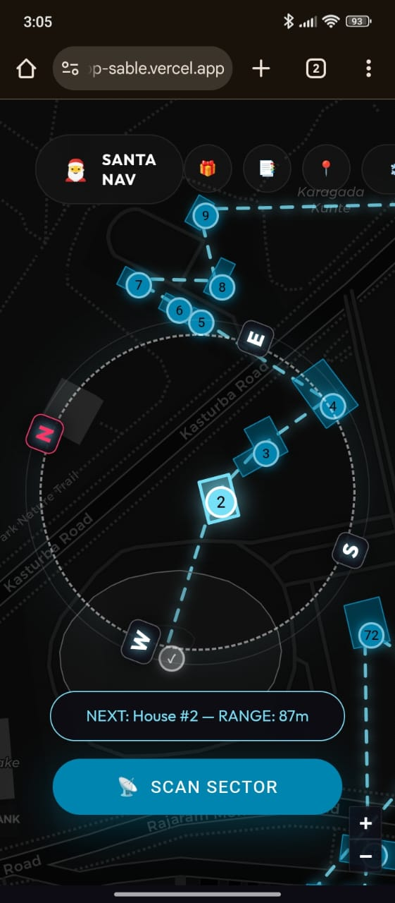

<div align="center">

  <h1>🎅 SANTA TERRACE NAVIGATOR</h1>

  <p>
    <strong>Tactical Gift Delivery System • High-Altitude LIDAR • Real-Time Routing</strong>
  </p>

  <p>
    <a href="https://santa-app-sable.vercel.app/">
      
    </a>
  </p>

  <p>
    
    
    
    
  </p>

  <br />

  

  <br />
  <br />

  <p align="center">
    <em>"Modern problems require tactical solutions." — North Pole Operations</em>
  </p>

</div>

---

## 🎁 Mission Brief

**The Santa Terrace Navigator (STN)** is the digital transformation of Sleigh Ops. It upgrades the North Pole from "Visual Flight Rules" to a precision **HUD (Heads-Up Display)** environment.


## 📸 Reconnaissance Imagery

<div align="center">

| **LIDAR Sector Scan** | **Tactical Route Lock** |
|:---:|:---:|
|  |  |
| *Satellite Scanning Active* | *Vector Pathing Confirmed* |

| **Gift Randomizer** | **Cargo Inventory** |
|:---:|:---:|
|  |  |
| *Physics-based Decision Engine* | *Payload Tracking System* |

</div>

---

## 🗺️ Operational Workflow

### 1. 🛰️ LIDAR Sector Scan
**Intelligence Gathering.**
The STN links directly to the **Overpass API** satellite network. With a single click of the `SCAN SECTOR` button, the system:
*   Queries OpenStreetMap data.
*   Filters for **High-Altitude Terraces** (`levels > 3` + `flat roof`).
*   Auto-hides hazardous landing zones.

### 2. 🎯 Flight Path Optimization
**Route Lock.**
Once targets are identified, the onboard computer calculates detailed flight vectors using nearest-neighbor algorithms to ensure zero wasted fuel.

### 3. 🎡 The "Gift Spin" Engine
**Tactical Decision Making.**
When a child's "Naughty/Nice" value is ambiguous, the Navigator deploys the **Spin Wheel**—a physics-based friction simulation that selects items directly from your current inventory payload.

---

## 🚀 Deployment Instructions

Initialize the tactical environment on your local machine:

```bash
# 1. Clone the Protocol
git clone https://github.com/mithul-mj/santa-app.git

# 2. Install Modules
npm install

# 3. Launch Mission Control
npm run dev
```

---

<div align="center">
  <p>Hand-crafted with 🎄 by <strong>Mithul MJ</strong></p>
  <p>Lead Engineer, North Pole R&D</p>
</div>
